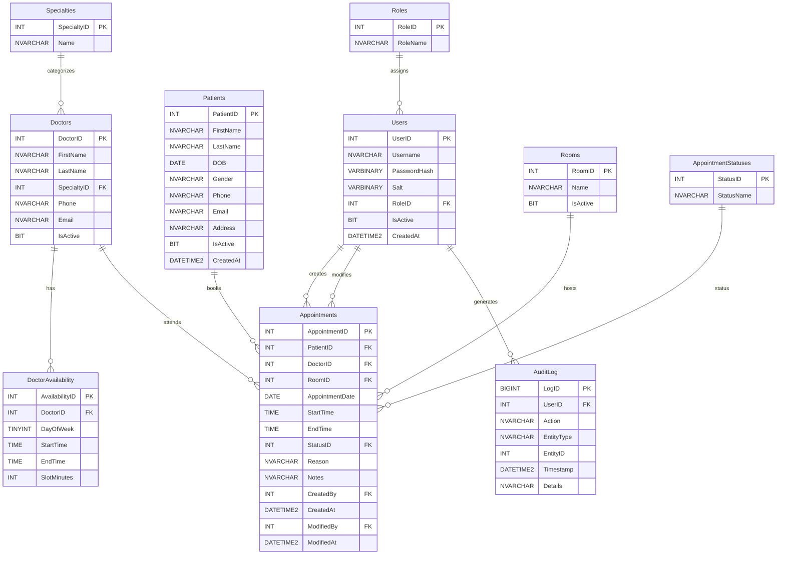

# Clinic Appointment Scheduler (CAS) - Entity Relationship Diagram

---

## Relationship Summary

| Parent Entity | Child Entity | Relationship |
|--------------|-------------|--------------|
| Roles | Users | 1-to-Many |
| Specialties | Doctors | 1-to-Many |
| Doctors | DoctorAvailability | 1-to-Many |
| Patients | Appointments | 1-to-Many |
| Doctors | Appointments | 1-to-Many |
| Rooms | Appointments | 1-to-Many |
| AppointmentStatuses | Appointments | 1-to-Many |
| Users | Appointments (CreatedBy) | 1-to-Many |
| Users | Appointments (ModifiedBy) | 1-to-Many |
| Users | AuditLog | 1-to-Many |

---

## Core Business Flow

1. A **User** (Administrator, Receptionist, or Doctor) logs into the system.
2. A **Patient** books an appointment with a **Doctor**.
3. Each doctor belongs to a **Specialty**.
4. Doctors define their weekly availability in **DoctorAvailability**.
5. An **Appointment**:
   - belongs to one Patient,
   - belongs to one Doctor,
   - may use one Room,
   - has one Appointment Status.
6. All important actions are recorded in **AuditLog**.